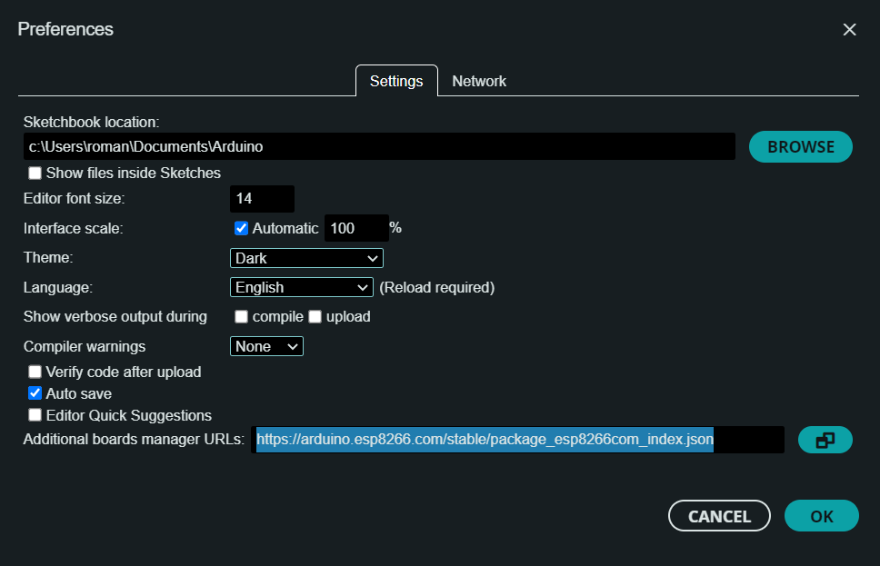

# Arduino
## Team 03 - RoomSense

Team members responsible: Roman Gordon, Boldizsar Olajos

Reviewers: Abel Turlej, Anna Vorozhtsova, Jasper Marichal

### Introduction
Our arduino codebase includes two seperate programs:
- The program that runs on the Arduino and collects the sensor data (located in the /arduino_program subfolder)
- The program that runs on our WiFi module (ESP8266 microcontroller) that sends this data on using wifi (located in the /esp8266_program subfolder)

To upload code to the WiFi module (to have the Arduino IDE find the board): In the Arduino IDE open File > Preferences and then in the "Additional boards manager URLs" add the following link: https://arduino.esp8266.com/stable/package_esp8266com_index.json

### Installation and Configuration Instructions
#### Install device
1. Mount the device to a wall or a place you want
2. Plug the device into a power outlet
3. Connect the device to your computer to connect to the wifi network
4. Once the device is connected to the wifi network you will have wireless connectivity

#### Configure Device to WiFi network
##### Start Configuration
1. Connect to the device via the USB-B port
2. Open a serial monitor software
3. Enter the command “SENDING OFF” to pause the sending of the data
4. Then enter either “CONFIG EDIT” or “CONFIG RESET” to enter configuration mode

##### Possible Commands
###### Basic Configuration Commands
- Command “SSID <network name>”: Change the SSID that the WiFi connects to
- Command “PASS <wifi password>”: Change the password that the WiFi connects to
- Command “USER <username>”: The username and identity for a WPA2-Enterprise network (experimental feature)

###### Static IP Configuration Commands
*Addresses and Subnet Masks must be entered in octet form*
- Command “IP <ip address>”: Set the static IP address to connect to
- Command “SN <subnet mask>”: Set the subnet mask of the local network
- Command “GW <gateway address>”: Set the gateway address of the local network
- Command “PORT <port number>”: Change the port to start the server at

###### Save Configuration
1. Enter the command “CONFIG COMMIT” to save the configuration changes
-  Or enter the command “CONFIG RESTORE” to discard the changes (only restore correctly if “CONFIG EDIT” was used)
2. Then unplug the device from the computer and plug it back in to its own USB-A port
3. Plug the device into the power outlet using the DC adapter

##### General Commands
- Command “CONFIG SHOW”: Show the active configuration
- Command “STATUS”: Show the wifi adapter status

#### Sensor Specifications:
- DHT11
    - Humidity sensor: 
        - 30% to 90% humidity at 0°C
        - 20% to 90% humidity at 25°C
        - 20% to 80% humidity at 50°C
        - 6s - 15s response time
        - +/- 1% accuracy
    - Temperature sensor:
        - 0°C to 50°C measuring range
        - +/- 1°C accuracy
        - 6s - 30s repsonse time
- MG811
    - CO2 sensor:
        - Operational temperature -20°C - 50°C
        - Output 0—10000ppm CO2
- KY038
    - Sound Sensor
        - Detection distance 10-80cm
        - Detection frequency range 3kHz - 6kHz
        - Operational temperature: -20°C - 80°C

#### Libraries Used:
##### Main Arduino Code 
###### All of these are found in lib folder of platformio project
- DHTlib 
    - Used to read from the DHT11
- RSLED 
    - Used to control the LED indicator
    - In-house library
- SoftwareSerial 
    - Used to send and recieve data to/from the ESP8266 (wifi module)

##### ESP8266 Code
###### This is a project made in the Arduino IDE
- ESP_EEPROM - v2.2.0 - Needs install via arduino IDE
    - Used for persisting the wifi config between resets and power offs
- ESP8266WiFi
    - Used for connecting to the wifi network using static IP or DHCP
- ArduinoWiFiServer
    - Simple telnet server used to transmit the sensor data on the local network, the wifi module hosts a small telnet server to which the ReadingSerial project connects to
- user_interface
    - Used by the wifi module (to interact with the SDK used for the wifi library)
- wpa2_enterprise
    - Used for connecting to WPA-2 enterprise networks, static IP settings are ignored in this case and this is an experimental feature
- c_types
    - To be able to use uint16_t and such types
